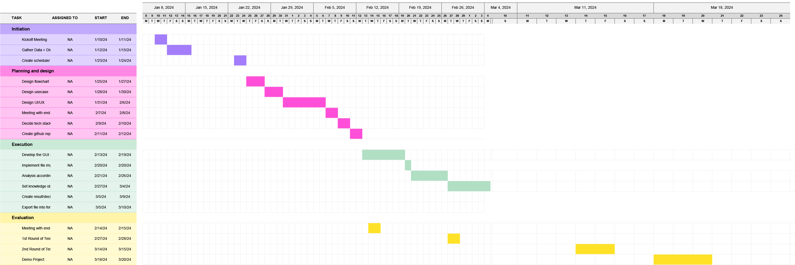

# Knowledge Object Extraction from Text
Group project for CEG4120 (Managing the Software Development Process)

## Important Links:
### Figma
* [Figma Document](https://www.figma.com/file/yigLXbqFhUM0d08wnWwYZO/Matador-Intelligence?type=design&node-id=0-1&mode=design&t=4lI3q5NsBOsNoIih-0)
* [Figma Presentation](https://www.figma.com/proto/yigLXbqFhUM0d08wnWwYZO/Matador-Intelligence?page-id=0%3A1&type=design&node-id=31-14&viewport=240%2C68%2C0.15&t=prX087bFNqJJPOW8-1&scaling=scale-down&starting-point-node-id=31%3A14)

### Sharepoint
* [Sharepoint Folder](https://raidermailwright-my.sharepoint.com/personal/weiland_6_wright_edu/_layouts/15/onedrive.aspx?id=%2Fpersonal%2Fweiland%5F6%5Fwright%5Fedu%2FDocuments%2FMatador%20Intelligence%20Project%20%2D%20CEG%204120&ga=1)
  * [Project Requirements](https://raidermailwright-my.sharepoint.com/:w:/r/personal/weiland_6_wright_edu/_layouts/15/doc2.aspx?sourcedoc=%7BFED29174-03BF-4A49-A174-5FB965D49ED9%7D&file=Project%20Requirements%20-%20Matador%20Intelligence.docx&action=default&mobileredirect=true)
  * [Project Schedule](https://raidermailwright-my.sharepoint.com/:w:/r/personal/weiland_6_wright_edu/_layouts/15/doc.aspx?sourcedoc=%7Bfe0c9a08-f901-4281-95eb-8e3f9d770842%7D&action=edit)

### Bootstrap
* [Bootstrap Website](https://getbootstrap.com/)
  * [Bootstrap Examples](https://getbootstrap.com/docs/5.3/examples/)  
* [Bootstrap 5 YouTube Tutorial](https://www.youtube.com/watch?v=4sosXZsdy-s&ab_channel=TraversyMedia)
